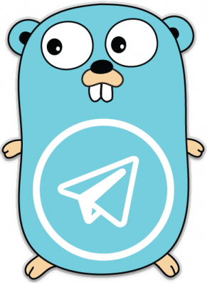

<p align="center">
    <a href="https://github.com/mitinarseny/telego">
        
    </a>
    <h1 align="center">telego</h1>
    <p align="center">Go Template for Telegram Bot</p>
    <p align="center">
      <a href="https://travis-ci.org/mitinarseny/telego"></a>
      <a href="https://golangci.com/r/github.com/mitinarseny/telego"></a>
      <a href="/LICENSE.md"></a>
      <a href="https://saythanks.io/to/mitinarseny"></a>
    </p>
</p>

## Table of Contents
* [Usage](#usage)

## Usage
* Create new bot with [@BotFather](https://t.me/BotFather) and copy the token (example: `12345689:ABCdEFgHi1JKLMNO23P45rSTU6vw78xyz-a`)
* Paste copied token in [docker-compose.yaml](./docker-compose.yaml):
  ```yaml
  services:
    bot:
      # ...
      environment:
        TELEGO_BOT_TOKEN: "<your_token_here>"
  ```
* Run services:
  ```bash
  docker-compose up -d
  ```

## Debug
To enter debug mode inside the container:
### Build
```bash
export _project_path=github.com/mitinarseny/telego
export _path=.
docker build -t telego_bot --target debugger --build-arg _project_path --build-arg _path . 
```
### Run
```bash
docker run --rm --network telego -e TELEGO_BOT_TOKEN="your_token_here" -p 40000:40000 --cap-add SYS_PTRACE telego_bot
``` 
