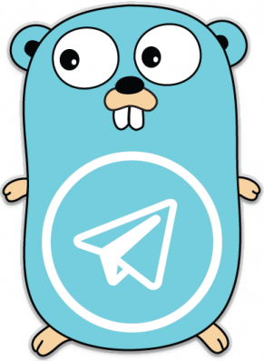

<p align="center">
  <a href="https://github.com/mitinarseny/telego">
    
  </a>
  <h1 align="center">telego</h1>
  <p align="center">Docker Go template for creating <a href="https://core.telegram.org/bots">Telegram Bots</a> with clean architecture.</p>
  <p align="center">
    <a href="https://travis-ci.org/mitinarseny/telego"></a>
    <a href="https://app.codacy.com/app/mitinarseny/telego"></a>
    <a href="https://golangci.com/r/github.com/mitinarseny/telego"></a>
    <a href="/LICENSE.md"></a>
    <a href="https://saythanks.io/to/mitinarseny"></a>
  </p>
</p>

## Table of Contents
* [Usage](#usage)
  * [Create Bot](#create-bot)
  * [Copy Token](#copy-token)
      * [Notifier](#notifier)
  * [Code](#code)
    * [Logic](#logic)
    * [Handlers](#handlers)
  * [Run](#run)
* [Debug](#debug)
  * [Build & Run](#build--run)
  * [Attach](#attach)
## Usage
### Create Bot
Create new bot with [@BotFather](https://t.me/BotFather).
### Copy Token
Create file `./docker-compose.secret.yaml` with the following structure and paste the token from [@BotFather](https://t.me/BotFather):
```yaml
# ./docker-compose.secret.yaml

version: '3.7'

services:
  bot:
    environment:
      TELEGO_BOT_TOKEN: "12345689:ABCdEFgHi1JKLMNO23P45rSTU6vw78xyz-a"
```
#### Notifier
You can enable Telegram notifications on your bot's status (`UP` or `DOWN`) by creating another bot and a group chat with this bot. Then edit `./docker-compose.secret.yaml`:
```yaml
# ...
environment:
  TELEGO_NOTIFIER_BOT_TOKEN: "<token>"
  TELEGO_NOTIFIER_CHAT_ID: "<chat_id>"
```
### Code
#### Logic
Main logic of the bot should be implemented inside `Configure` function in [`bot/bot.go`](bot/bot.go):
```go
func Configure(b *tb.Bot) (*tb.Bot, error) {
    h := handlers.Handler{Bot: b}
    b.Handle("/hello", withLogMsg(h.HandleHello))
    return b, nil
}

func withLogMsg(handler func(*tb.Message) error) func(message *tb.Message) {
    return func(m *tb.Message) {
        if err := handler(m); err != nil {
            log.WithFields(log.Fields{
                "context": "BOT",
                "handler": handler,
            }).Error(err)
        }
    }
}
```
#### Handlers
All hanlders should be placed in [`bot/handlers/`](bot/handlers). Here is an example from [`hello.go`](bot/handlers/hello.go):
```go
func (b *Handler) HandleHello(m *tb.Message) error {
    _, err := b.Bot.Send(m.Sender, "Hello, world!")
    return err
}
```
### Run
```bash
docker-compose \
  -f docker-compose.yaml \
  -f docker-compose.secret.yaml \
  up --build -d
```

## Debug
You can debug your code with [Delve](https://github.com/go-delve/delve) debugger. 
### Build & Run
To enable [dlv](https://github.com/go-delve/delve) debugger inside the container run:
```bash
docker-compose \
  -f docker-compose.yaml \ 
  -f docker-compose.dev.yaml \
  -f docker-compose.secret.yaml \
  up --build -d
``` 
### Attach
```bash
${GOPATH}/bin/dlv connect localhost:40000
```
